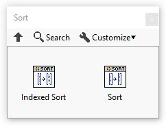
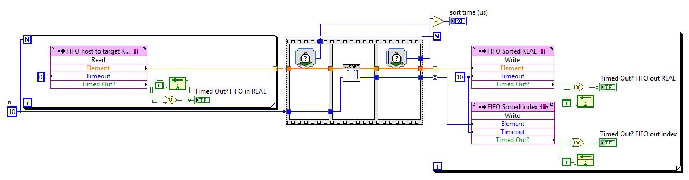

# LabVIEW-FPGA-Sort
A LabVIEW library for sorting 1D arrays on FPGAs. This library is designed for ease of use over efficiency or timing.

The provided palette has functions for 
- Sort
- Indexed Sort

All functions only support the single precisions floating data type.

These functions enable array-based deployment of algorithms to FPGAs. Arrays are stored in the look-up tables (LUT) for ease of implementation. 

## How do I install this?
Click [Releases](https://github.com/ARTS-Laboratory/LabVIEW-FPGA-Sort/releases) on the right-hand side of the screen and download the latest release. The .vip file is what you want and is called "arts_lab_lib_array_based_sort-x.x.x.x.vip". You can install .vip files through NI's VIPM Browser. 

## [Development workspace](development_workspace)
Houses all the code used in building and developing the functions, including test deployments to FPGAs. 

## [Package](package)
Houses the published packages.

## Licensing and Citation

[![CC BY-SA 4.0][cc-by-sa-shield]][cc-by-sa]

This work is licensed under a
[Creative Commons Attribution-ShareAlike 4.0 International License][cc-by-sa].

[cc-by-sa]: http://creativecommons.org/licenses/by-sa/4.0/
[cc-by-sa-image]: https://licensebuttons.net/l/by-sa/4.0/88x31.png
[cc-by-sa-shield]: https://img.shields.io/badge/License-CC%20BY--SA%204.0-lightgrey.svg

Cite as:

@Misc{Flemming2022SolarChargedUAV,  
  author       = {Austin Downey},  
  howpublished = {GitHub},  
  month        = dec,   
  title        = {LabVIEW FPGA Sort}, 
  year         = {2021},    
  groups       = {{ARTS-L}ab},  
  url          = {https://github.com/ARTS-Laboratory/LabVIEW-FPGA-Sort},    
}

